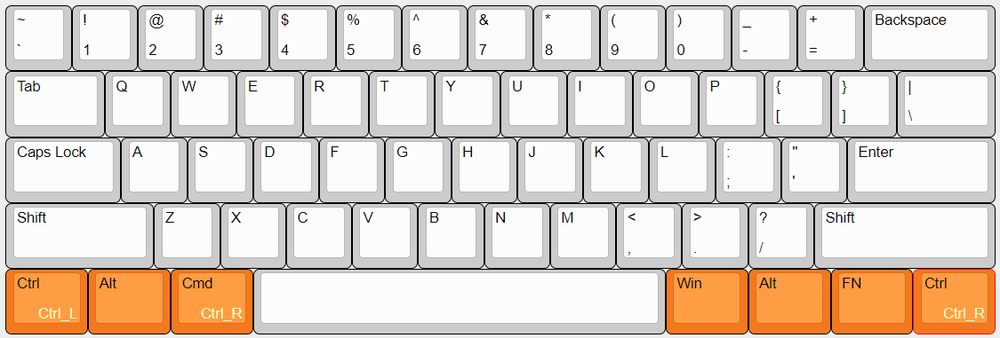
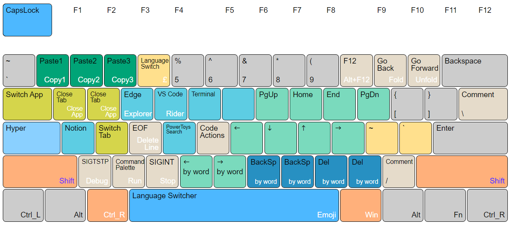

## Hyper CapsLock Unified

> *Make CapsLock Consistently Great on MacOS and Windows!*

I'm an user switching between my work PC and my personal Mac for different coding projects. My goal is to create configurations so I can have almost identical experiences when on MacOS and Windows, with or without my small external ANSI 60 keyboard.

### Highlights

Based on [Vonng/Capslock](https://github.com/Vonng/Capslock), and some extra features are introduced:

* Consistent shortcut combinations between MacOS and Windows with different keyboard layouts.
* Duplicated key combos for a greater redundancy, less typo and ease of use.
* Removed hard to reach and less used key combinations for better ergonomics.
* Remapped the app launch keys accoding to their initials.
* Remapped frequent IDE functions to keys with close semantic meanings, such as <kbd>-</kbd> and <kbd>+</kbd> for `Fold` and `Unfold`.
* Remapped <kbd>#</kbd>, <kbd>£</kbd>, <kbd>`</kbd> and <kbd>~</kbd>, so they are typed in consistent fashions across keyboard and OS.
* Simplified to have only one extra modifier, the left <kbd>Cmd</kbd> key, when <kbd>Hyper</kbd> is used.

### ANSI 60 Key and Keycap change

My external keyboard has a small ANSI 60 keys layout that is different from both my Mac and Windows laptop's UK ISO keyboards. It's reprogrammed with firmware to have the left modifier keys (<kbd>Ctrl</kbd>/<kbd>Win</kbd>/<kbd>Alt</kbd>) swapped to (<kbd>Ctrl_L</kbd>/<kbd>Alt</kbd>/<kbd>Ctrl_R</kbd>) to allow the same finger positions for the same Hyper shortcuts defined in both MacOS and Windows.

------------------------

## CapsLock Enhancement Windows

The additional <kbd>Ctrl_R</kbd> key gives a close <kbd>⌘</kbd> experience when in Windows, While the original <kbd>Ctrl_L</kbd> key on the left makes Windows users feel at home by keeping Windows `Ctrl+` shortcuts unchanged.

Only the top `Hyper+` layer are kept for the middle <kbd>T</kbd>, <kbd>G</kbd>, <kbd>V</kbd> and <kbd>B</kbd> keys because they are difficult to reach for the `Hyper+Ctrl+` layer.

------------------------

## CapsLock Enhancement Mac

Mac keyboard layout is designed slightly different than normal ANSI/ISO layouts. Its wider and slighly left moved <kbd>⌘</kbd> key is more ergonomics for usual <kbd>⌘</kbd>+<kbd>C</kbd> or <kbd>⌘</kbd>+<kbd>V</kbd>. And it allows slighly easier reach for <kbd>T</kbd>, <kbd>Y</kbd>, <kbd>G</kbd>, <kbd>V</kbd> and <kbd>B</kbd> keys when <kbd>CapsLock</kbd> and <kbd>⌘</kbd> are both pressed.

Use **Karabiner-Elements**'s simple rule to change <kbd>Ctrl_R</kbd> to <kbd>Cmd_L</kbd> for the external ANSI keyboard only. All other complex rules defined in the JSON file can then be loaded for consistent Hyper features.

### Installation

It only takes two steps to enable Capslock on your Mac: Download & Enable

1. Download

   Download & Install [**Karabiner-Elements**](https://karabiner-elements.pqrs.org/).

   Following the wizard and grant required permissions (Settings - Security - Privacy)

2. [Enable](karabiner://karabiner/assets/complex_modifications/import?url=https://ke-complex-modifications.pqrs.org/json/caps_lock_enhancement.json)

   Open this [link](karabiner://karabiner/assets/complex_modifications/import?url=https://raw.githubusercontent.com/darkato42/Capslock/master/mac/capslock.json) with Safari. It will launch Karabiner-Elements and import the configuration.

   `karabiner://karabiner/assets/complex_modifications/import?url=https://raw.githubusercontent.com/darkato42/Capslock/master/mac/capslock.json`

   Click `Enable All` on pop-up dialog. It will affect immediately.

   You can now try moving cursor with ⇪ + h,j,k,l , And exploring more features below.